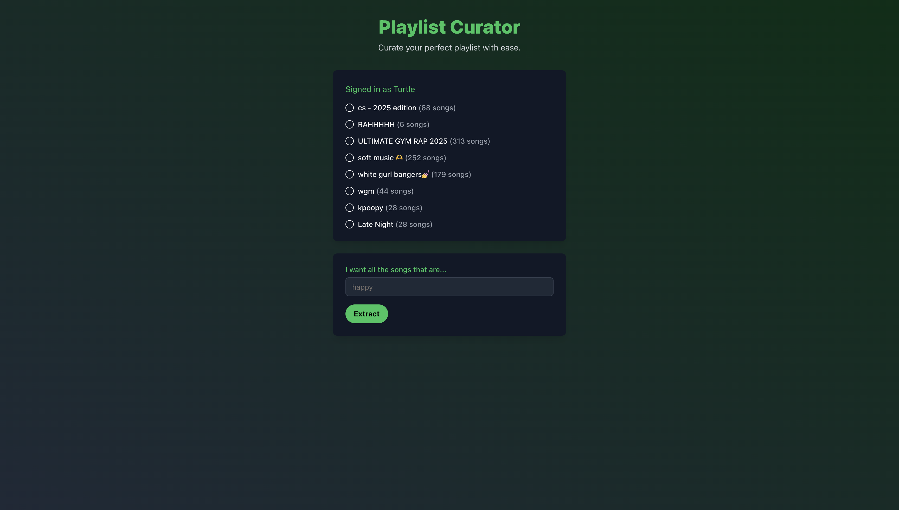
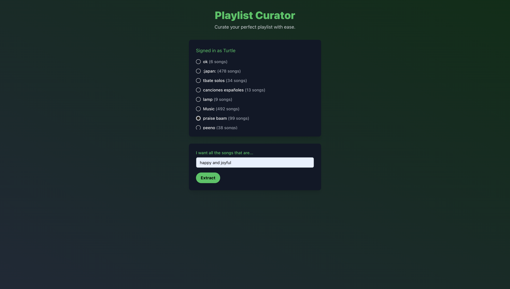

# Playlist Curator

Project submitted to BoilerMake XII by Caleb Li, Marvin Zhang, Keshav Sreekantham,
and Jeremy Moon.

Refer to our [Devpost page]() to read about the motivations, development, and challenges
of creating this project.

# App Screenshots

# Project Structure

**Back End (/backend):** uses natural language processing models to convert
input text into filters, sends extracted playlist back to client.

- /backend/api/views.py handles logic for extracting songs based on user descriptions

**Front End (/front-end):** renders the web application to user, handles
Spotify authentication, and interacts with Spotify API.

- /front-end/app/page.tsx is the main file with layout structures and styling
- /front-end/app/spotify.js handles receiving an access token from Spotify
